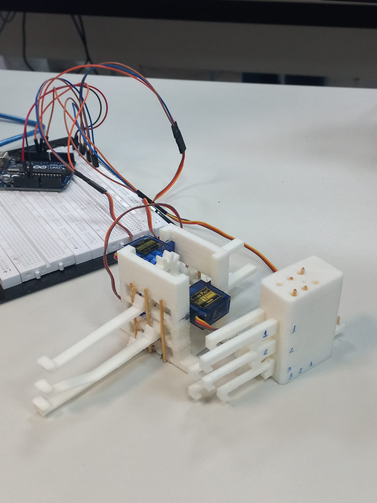
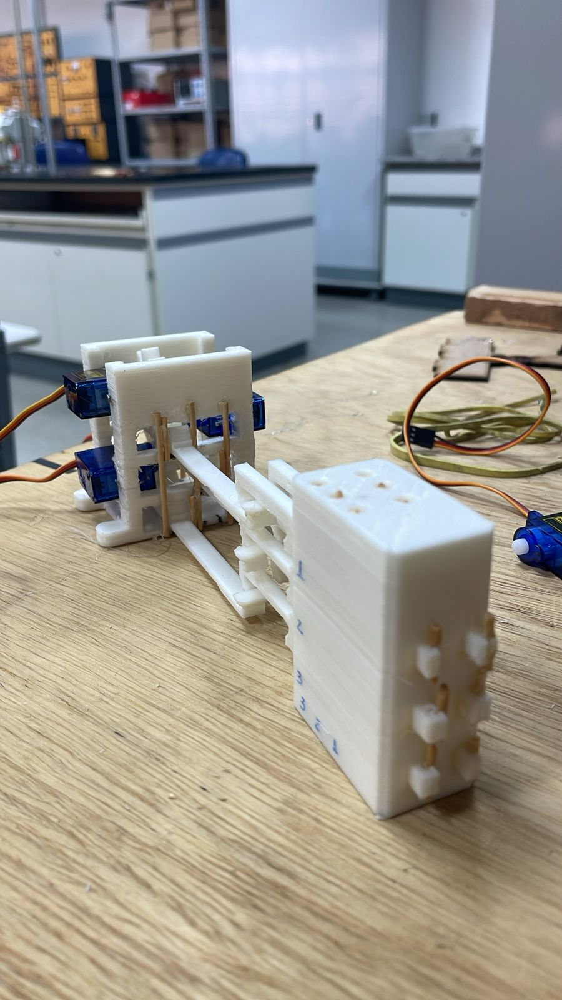
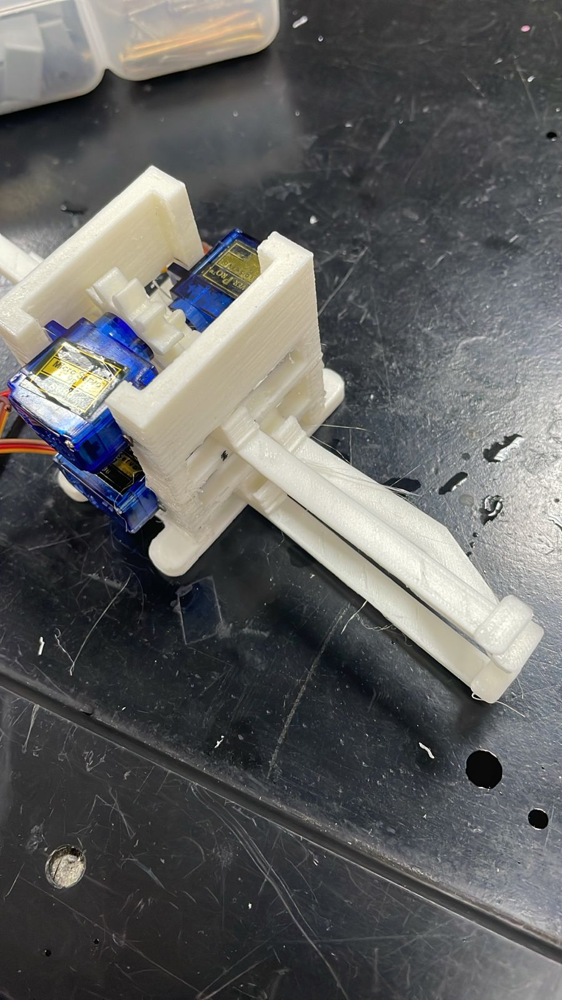
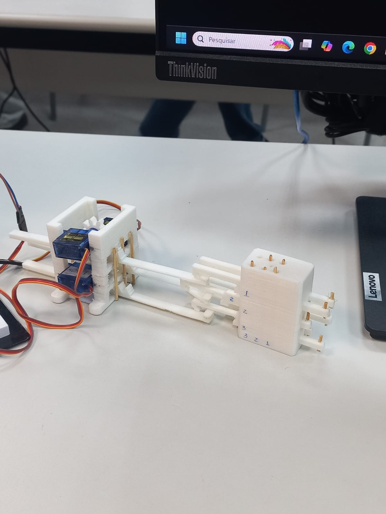

# Refreshable Braille Cell

A refreshable braille cell and actuator, created with 3D printing and laser cutting. The project was hosted on a cloud drive solution and then put here on github after the end of the course.

This group project was developed as part of a university course on Solutions for Engineering Challenges at Universidade Federal do ABC (UFABC), focusing on acessibility, fast prototyping using 3D printing and laser cutting, iterative design and an Arduino board for logic.

Inspired by [Braille Systems's braille display](https://github.com/braille-systems/braille-display). Some pieces were taken directly from their files, those made by the group are available on this repo.

## **Final result**

    
    
    
    

## **Table of Contents**
- [What was created](#what-was-created)
- [My Contribuition](#my-contribuition)
- [License](#license)

## **What was created**
- **Functional braille display utilizing 3D printing and laser cutting to create tactile modules**
- **Arduino based logic** to control **servo-motors** that actuate the pins

## **My Contribution**
- **Designed** the arduino code that controls the pins architecture and assembled the electronic part of the system.
- **Helped** with prototyping and necessary changes or fixes for the pieces to work together
- **Wrote documentation in LaTeX** for coursework assignments

## **License**
This project is for **educational and viewing purposes only**.  
No part of this repository may be copied, modified, distributed, or used in any way without **explicit permission** from the authors.

- Braille Systems
Feel free to message us if there are any problems with the use of your files
